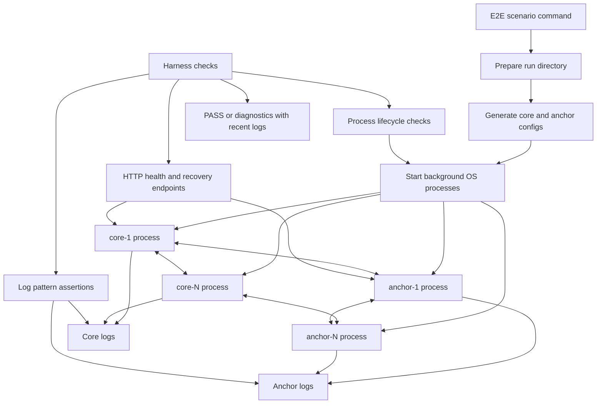

# E2E Test Coverage

## How The E2E Harness Works

These tests are not unit tests or mocked integration tests. The harness creates
real network configs, starts real `modulr-core` and `modulr-anchors-core`
processes in the background, captures their logs, and verifies behavior through
HTTP endpoints plus runtime log evidence.

### Test 1: Launch a simple network with 1 validator and 1 anchor

Description:
Starts a minimal `1 core + 1 anchor` network through the E2E harness.

Goal:
Verify that the harness can prepare configs, start real OS processes, wait for health checks, and observe core height growth.

Result:
The core node produces blocks, the anchor node stays healthy, and the harness can stop the network cleanly.

### Test 2: Anchor pulls ALFP after core push failure

Description:
Runs a `1 core + 1 anchor` network with a local proxy blocking ALFP POST delivery from core to anchor.

Goal:
Verify that anchors-core can proactively collect the missing ALFP from the core quorum instead of relying only on pushed proofs.

Result:
The anchor logs show that it built the ALFP locally and included it in an anchor block.

### Test 3: Core epoch rotation and anchor ACK

Description:
Runs a fast `1 core + 1 anchor` network through the first core epoch transition.

Goal:
Verify that core sends an aggregated epoch rotation proof, anchors-core applies it, and core stores the corresponding anchor ACK proof.

Result:
The anchor applies the `0 -> 1` core quorum transition and core exposes `/aggregated_anchor_epoch_ack_proof/1`.

### Test 4: Recovery latest core quorum API

Description:
Runs a `1 core + 1 anchor` network, then restarts the anchor in `RECOVERY_MODE`.

Goal:
Verify that `/recovery/latest_core_quorum` returns a signed recovery payload for the latest known core quorum.

Result:
The response signature is valid and the payload points to the `0 -> 1` core rotation proof with validator endpoints.

### Test 5: Multi-node quorum smoke

Description:
Runs a real quorum-shaped `4 core + 4 anchors` network.

Goal:
Verify the normal multi-node path for core epoch rotation, anchor application of the transition, anchor ACK majority, and recovery majority responses.

Result:
Core rotates epochs, anchors apply the transition, core exposes an anchor ACK proof with majority signatures, and a recovery anchor majority returns signed latest quorum responses.

### Test 6: Multi-node with one anchor down

Description:
Starts `4 core + 4 anchors`, then stops one anchor before the first core epoch rotation.

Goal:
Verify that the system still progresses with an anchor majority and does not require all anchors to be online.

Result:
Core collects an anchor ACK proof with `3/4` signatures and recovery latest quorum responses are available from enough anchors.

### Test 7: Multi-node with one core validator down

Description:
Starts `4 core + 4 anchors`, then stops one core validator before epoch rotation.

Goal:
Verify that the remaining core quorum can still produce a valid epoch rotation proof.

Result:
Anchors apply the transition and recovery responses expose a core rotation proof with `3/4` core signatures.

### Test 8: Multi-node ALFP pull after push failure

Description:
Runs `4 core + 4 anchors` and routes one anchor's ALFP POST traffic through a blocking proxy.

Goal:
Verify anchor-side ALFP recovery in a real multi-node quorum network.

Result:
The targeted anchor builds the missing ALFP from the core quorum and includes it in an anchor block despite blocked core pushes.

### Test 9: Recovery majority latest quorum convergence

Description:
Runs `4 core + 4 anchors` to at least epoch `2`, then restarts only `3/4` anchors in `RECOVERY_MODE`.

Goal:
Verify that a recovery anchor majority agrees on the same latest core epoch and hash.

Result:
All responding recovery anchors return valid signed payloads and converge on the same latest core quorum proof.

### Test 10: Lagging anchor in-memory catch-up

Description:
Snapshots one anchor at epoch `1`, lets the full network advance to epoch `2`, then restores that old anchor snapshot and starts recovery anchors.

Goal:
Verify that a lagging anchor can catch up in memory without mutating durable state during recovery mode.

Result:
The lagging anchor returns a signed `/recovery/core_quorum/2` response showing it caught up from durable epoch `1` to the target epoch.

### Test 11: Network partition does not create false recovery majority

Description:
Runs `4 core + 4 anchors` to at least epoch `2`, then restarts only `2/4` anchors in `RECOVERY_MODE`.

Goal:
Verify that valid responses from an anchor minority cannot be treated as a recovery majority.

Result:
The minority anchors return valid signed core quorum responses, but the harness confirms only `2/4` unique anchor signatures were collected, below the required `3/4` majority.
