# Recovery Description

This document gives a short, schematic view of the recovery flow after a `modulr-core` network crash.

## Goal

After a crash, operators need to answer two questions:

1. What was the latest valid `modulr-core` epoch known by the network?
2. What was the latest finalized absolute height in that epoch?

Recovery uses `modulr-anchors-core` first, because anchors persist `AggregatedEpochRotationProof` data received from `modulr-core`. That proof tells us the latest known core epoch transition and the validator data needed to query the correct core quorum.

## Phase 1: Discover the Latest Core Epoch

The recovery script queries anchor nodes for their latest known core quorum data.

These queries are possible because every normal `modulr-core` epoch rotation is anchored first:

1. The core quorum builds an `AggregatedEpochRotationProof` (AERP) for epoch `N -> N+1`.
2. The core quorum sends that AERP to `modulr-anchors-core`.
3. Anchors persist the AERP and sign acknowledgements.
4. `modulr-core` waits for a majority of anchor acknowledgements.
5. Only after that majority ACK exists can the core network start sequencing blocks for epoch `N+1`.

This means the latest core epoch accepted by the running network must already be known by a majority of anchors.

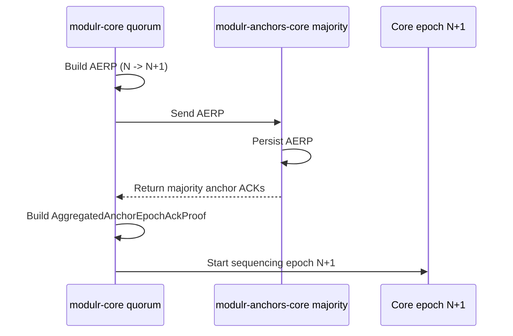

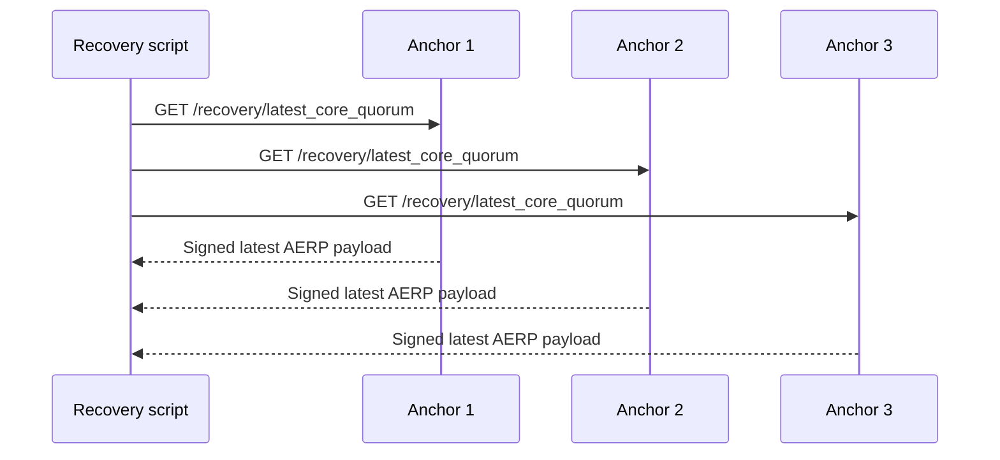

The script verifies anchor signatures and groups responses by the reported `AggregatedEpochRotationProof`.

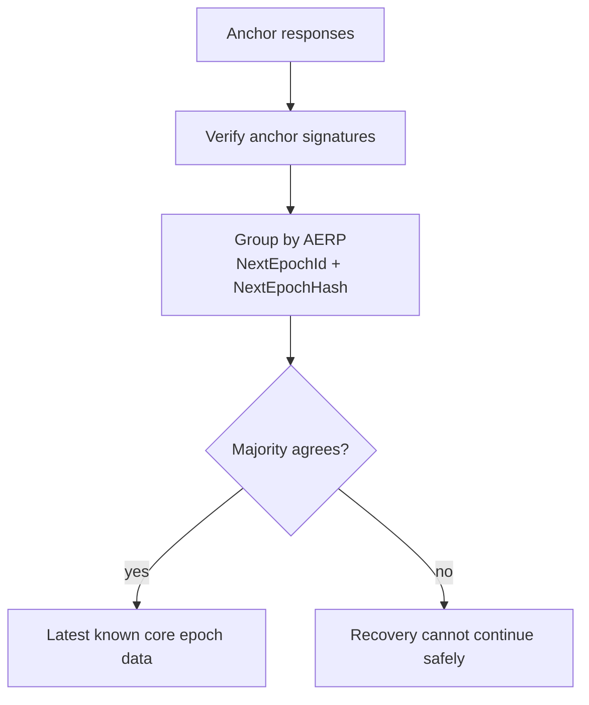

The winning AERP gives the recovery process the latest known core epoch data:

- latest epoch id
- latest epoch hash
- next quorum
- next leaders sequence
- validator HTTP/WSS endpoints collected by anchors

Under the normal fault model, recovery should eventually be able to discover this data. Since `modulr-core` requires a majority of anchor ACKs before moving to the next epoch, and less than one third of anchors are assumed malicious, that majority contains at least one honest anchor. An honest anchor can provide a valid AERP chain, allowing lagging anchors to align their local recovery state and allowing the script to obtain a majority agreement on the latest epoch.

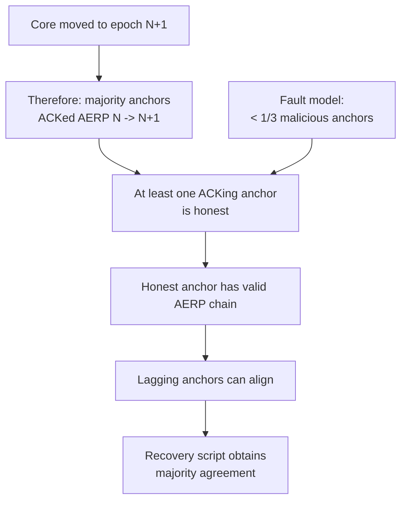

Example with 5 anchors:

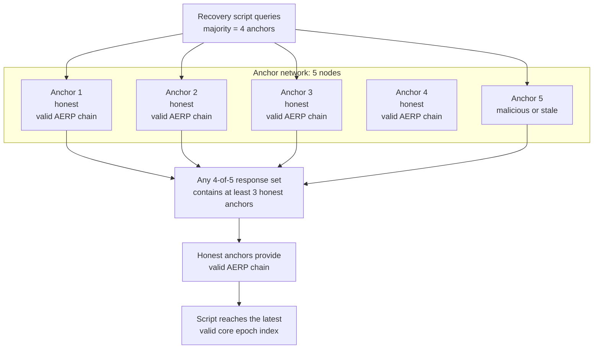

Because the core network could only enter epoch `N+1` after a majority of anchors acknowledged the AERP for `N -> N+1`, at least one honest anchor in the queried majority can provide the valid proof path. With 5 anchors and fewer than one third malicious, a majority query gives enough honest responses to recover the valid AERP chain up to the latest accepted epoch.

## Phase 2: Query the Latest Core Quorum

Once the script knows the latest core quorum, it queries those validators for their latest finalized height. Each validator can return its local view of the latest height, but that height is only accepted if it is backed by a proof signed by the core quorum majority.

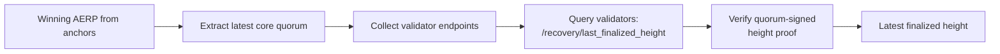

The script tries all known HTTP endpoints for each validator until one succeeds.

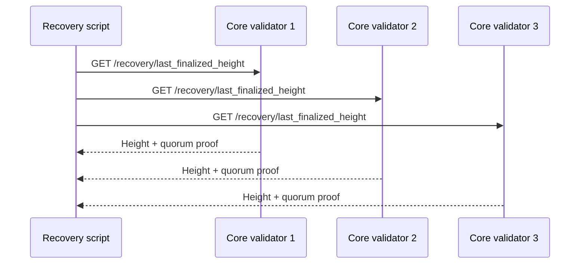

The script verifies the quorum signatures inside each height proof and keeps only valid finalized heights. Since a valid height must be signed by a majority of the discovered core quorum, the script can reject unfinalized or fabricated answers and select the latest finalized height from the valid proofs.

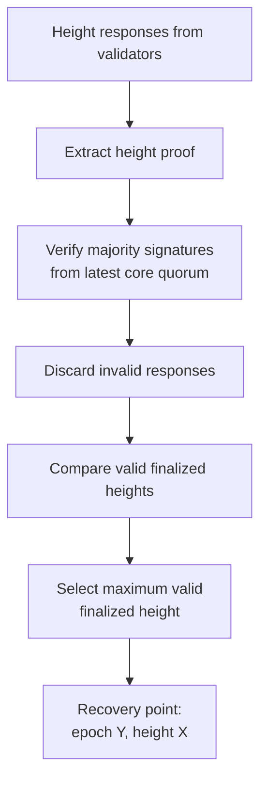

## Phase 3: Build the Restart Genesis

After the recovery script knows the recovery point `(Y, X)`, it asks the same discovered core quorum for a signed genesis template.

The template is not a full genesis file. It contains only the fields that must be carried into the restarted network:

- `CORE_MAJOR_VERSION`
- `NETWORK_PARAMETERS`
- `VALIDATORS`
- source epoch id and source epoch hash

The script verifies validator signatures and requires a core quorum majority to return the same template. It also checks that the template source matches the winning AERP from Phase 1.

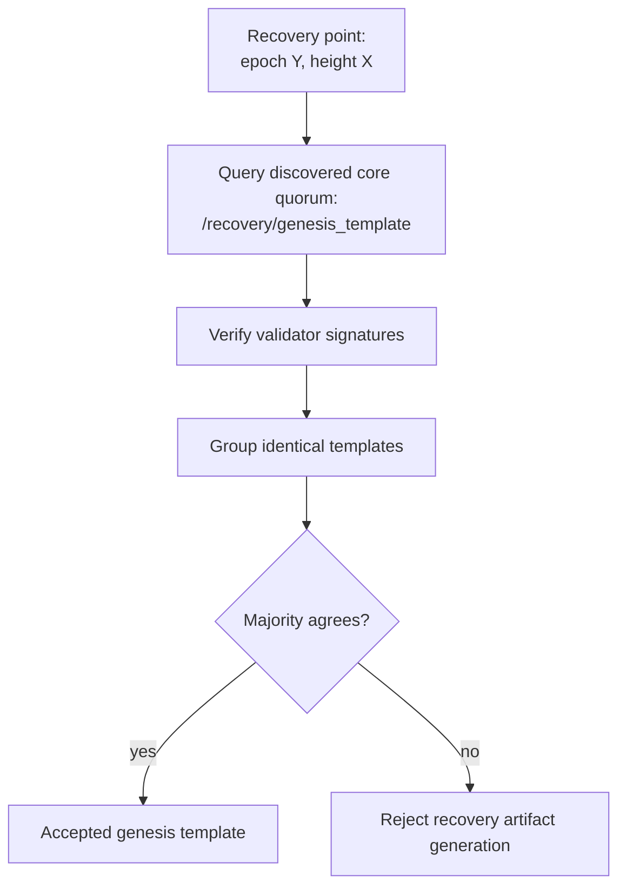

The devops recovery script then builds the new genesis itself:

1. Generates a new `NETWORK_ID`.
2. Chooses a fresh `FIRST_EPOCH_START_TIMESTAMP`.
3. Copies `CORE_MAJOR_VERSION`, `NETWORK_PARAMETERS`, and `VALIDATORS` from the accepted template.
4. Omits `STATE` and `EVM_ALLOC`, because recovery preserves `STATE` from the old chain instead of seeding balances from genesis.

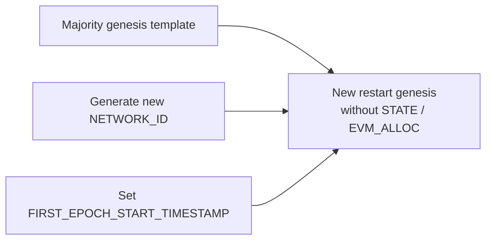

## Phase 4: Produce a Team-Signed Recovery Artifact

The devops recovery script writes a `recovery.json` artifact for node operators. The artifact contains:

- `lastEpochIndex`: `Y`
- `lastAbsoluteHeight`: `X`
- `genesis`: the generated restart genesis
- `teamSig`: project-team signature

The signed payload is:

```text
RECOVERY_RESTART:<lastEpochIndex>:<lastAbsoluteHeight>:<blake3(canonicalGenesisJSON)>
```

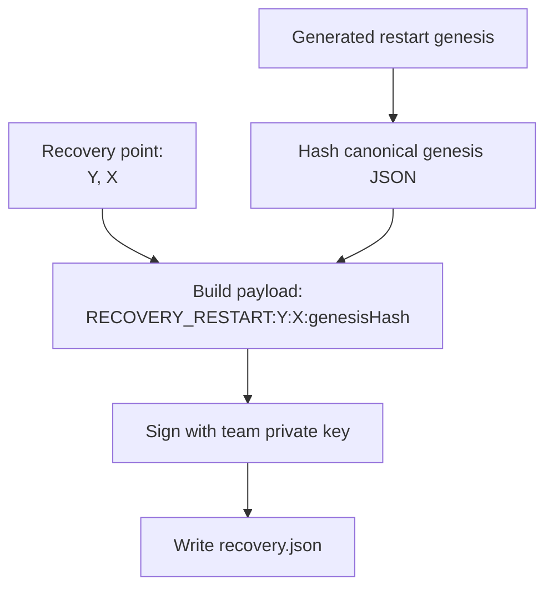

## Phase 5: Local Operator Registration

Each validator operator runs the local `modulr-core/scripts/recovery` command with the team-signed `recovery.json`.

The local script does not immediately rewrite `CHAIN_CURSOR` to the new network. Instead, it verifies the team signature and stores the recovery plan in `STATE`:

- `RECOVERY_DATA:<X>` -> signed recovery object
- `RECOVERY_ACTIVE` -> `X`

This lets the node start immediately with the new genesis while still knowing the exact old-chain height where execution must switch to the new era.

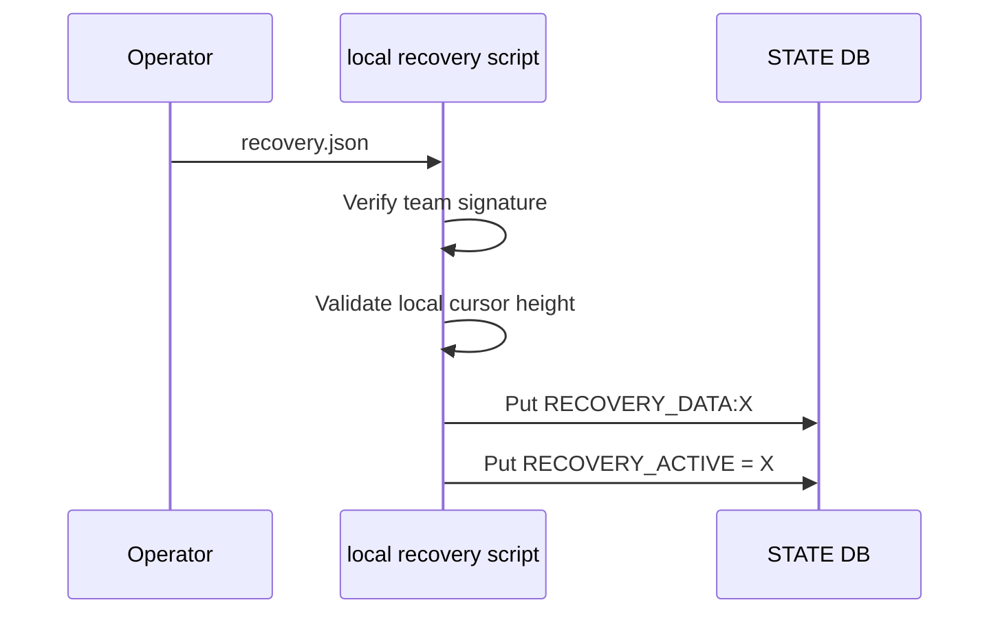

## Phase 6: Runtime Transition

On startup, the node loads the normal `globals.GENESIS`, which is already the new restart genesis.

If `CHAIN_CURSOR.NetworkId` still points to the old network, the mismatch is allowed only when a valid active recovery plan exists in `STATE`. Until the execution thread reaches `lastAbsoluteHeight = X`, it continues executing old-era blocks and can read them from the old network-specific `BLOCKS` database.

When execution reaches height `X`, the recovery transition is applied atomically:

1. Store final epoch statistics for epoch `Y`.
2. Delete stale delayed transactions from future old-era epochs.
3. Patch `CHAIN_CURSOR.EpochOffset = Y + 1`.
4. Keep `CHAIN_CURSOR.Statistics.LastHeight = X`.
5. Replace cursor network data with the generated genesis data.
6. Build the new genesis epoch handler.
7. Stage new genesis validators/accounts when needed.
8. Remove `RECOVERY_ACTIVE` and `RECOVERY_DATA:<X>`.

After that, the node continues in the restarted network. For API and explorer consumers, history remains linear: the next block is absolute height `X+1`, and the next epoch is absolute epoch `Y+1`.

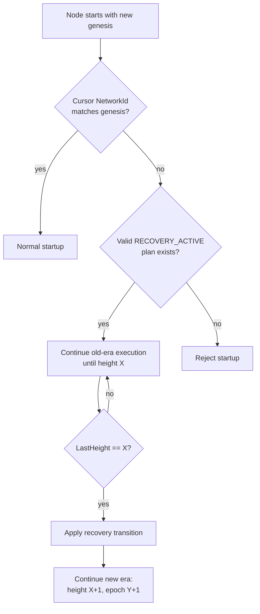

## End-to-End Recovery View

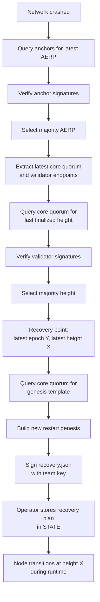

## Result

The recovery process produces a signed `recovery.json` artifact, not just two scalar values.

It contains:

- `Y`: the latest valid core epoch known through anchors.
- `X`: the latest finalized absolute height agreed by the latest core quorum.
- a generated restart genesis.
- a team signature over the recovery restart payload.

Operators register that artifact locally. The node then performs the cursor transition itself when execution reaches `X`.

After the transition, the new era begins at absolute epoch `Y+1` and absolute height `X+1`.
